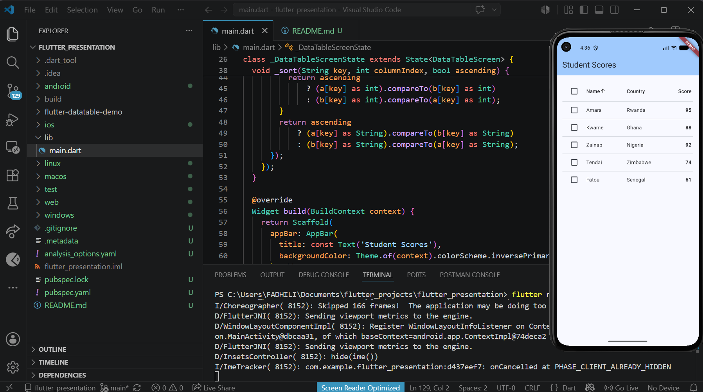

# Flutter DataTable Demo

A simple Flutter application demonstrating the Flutter `DataTable` widget for displaying, sorting, and selecting tabular data.

## How to run

1. Make sure Flutter is installed — https://flutter.dev
2. Clone this repo: https://github.com/Fadhili-N/flutter-datatable-demo.git

3. Navigate into the folder:
cd flutter-datatable-demo
4. Run the app:
flutter run

## Features Demonstrated

* Sortable columns using `DataColumn.onSort`
* Row selection using `DataRow.selected` and `onSelectChanged`
* Horizontal scrolling with `SingleChildScrollView`
* Custom widgets inside `DataCell`
* Dynamic UI updates with `setState()`
* Configurable row and column spacing using DataTable properties

## Key DataTable Properties

### columns

Defines the table headers using `DataColumn`.

### rows

Defines the table content using a list of `DataRow` widgets containing `DataCell` widgets.

### sortColumnIndex and sortAscending

Control which column is currently sorted and the sorting direction.

## Screenshot

## Source

* Flutter DataTable Documentation: https://api.flutter.dev/flutter/material/DataTable-class.html
